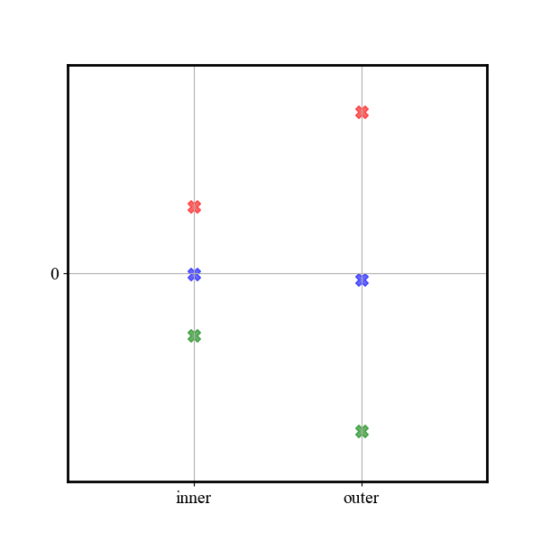
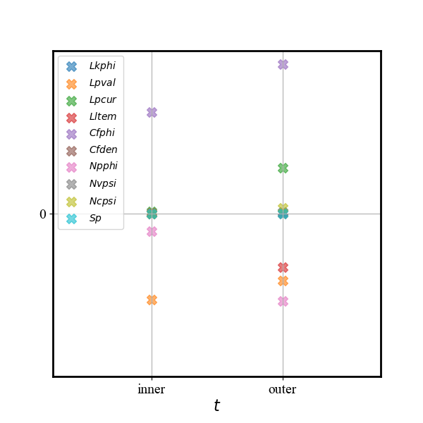
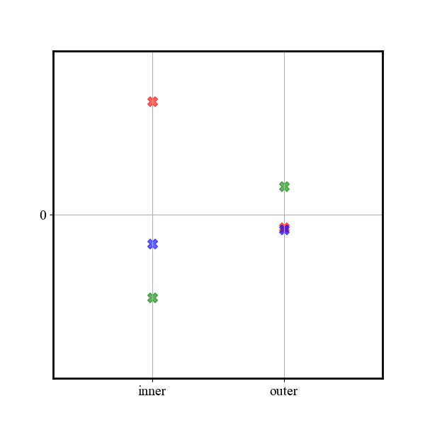
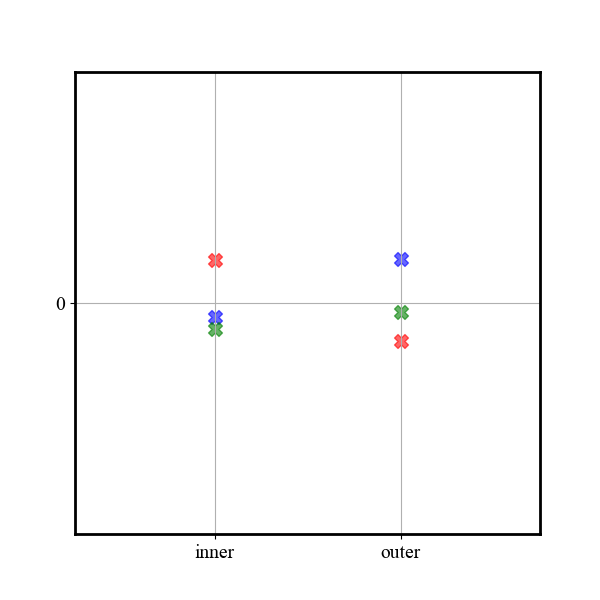
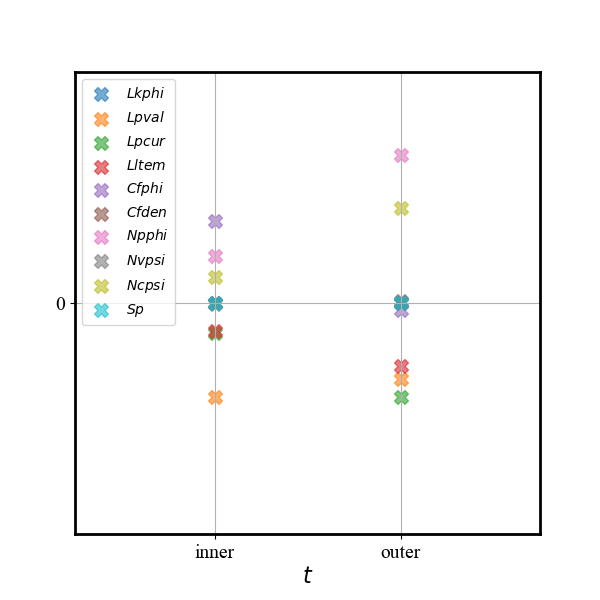

五场模型下ITG和KBM湍流的非线性演化的比较

- 文献， local,global
- 思路： 
---

### 1. 线性结果

- 增长率，频率
- RH flow 

### 2. 非线性结果
- 能量演化： 
    

    
    

        
    > 具有和一般动理学模拟相似的结果：
    > KBM湍流磁能比ITG湍流强
    > ZF在ITG湍流中占主导，在KBM湍流中相对较弱

- 非线性扰动
    

    
    

    > 静电势扰动，高模数扰动占主导
    > 磁矢势扰动，低模数扰动占主导

- 湍流能量演化
    
- 湍流能谱
    

- zf能量演化
    $\beta=0.1\%$时的ZF的驱动演化以及时间平均后的数值
    

    
    

    

    
    

    > ZF能量从湍流中通过雷诺应力产生，通过曲率项传递给(1,0)分量
    > maxwell应力的作用基本可以忽略

    $\beta=0.1\%$时的$p_{1/0}$的驱动演化以及时间平均后的数值
    

    
    

    

    
    

    > p(1,0)能量主要通过ZF的曲率项产生
    > 静态ZF区p(1,0)能量传递给声波
    > GAM区p(1,0)能量通过朗道阻尼耗散，或者通过对流非线性项回到湍流，以及同样的传递给声波

    $\beta=1.0\%$时的ZF的驱动演化以及时间平均后的数值，左下为t=100-250平均之后，右下为t=300-400平均之后
    

    
    

    

    
    

    > 静态ZF区的驱动作用和低beta时一样，maxwell应力具有有限的作用
    > 外区主要驱动源在不同阶段不一样，可以看到maxwell应力或者曲率项占主导，虽然不一样，但雷诺张量一直都是平均为负

    

    
    

    

    
    

    > 静态ZF区占主导作用的驱动仍然和beta=0.1%时一样，但是有其他驱动项的作用，比如非线性项
    > 外区主要驱动源是非线性项，甚至通过曲率项向ZF传递能量
    > 这个结果和之前ZF的驱动分析保持对应
