五场模型下ITG和KBM湍流的非线性演化的比较

- 文献， local,global
- 思路： 
---

### 1. 线性结果

- 增长率，频率

- RH flow 

### 2. 非线性结果
- 能量演化： 
    

    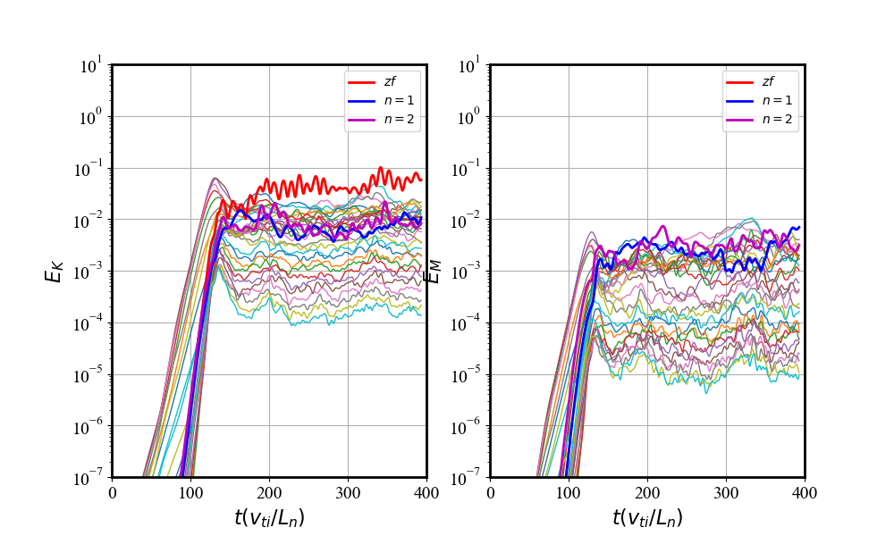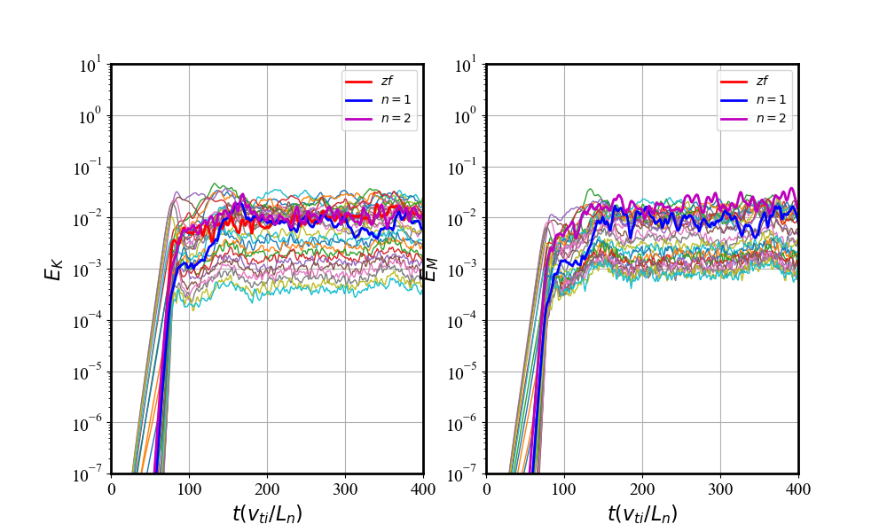
    

    具有和一般动理学模拟相似的结果：
    - KBM湍流磁能比ITG湍流强
    - ZF在ITG湍流中占主导，在KBM湍流中相对较弱

- 非线性扰动
    

    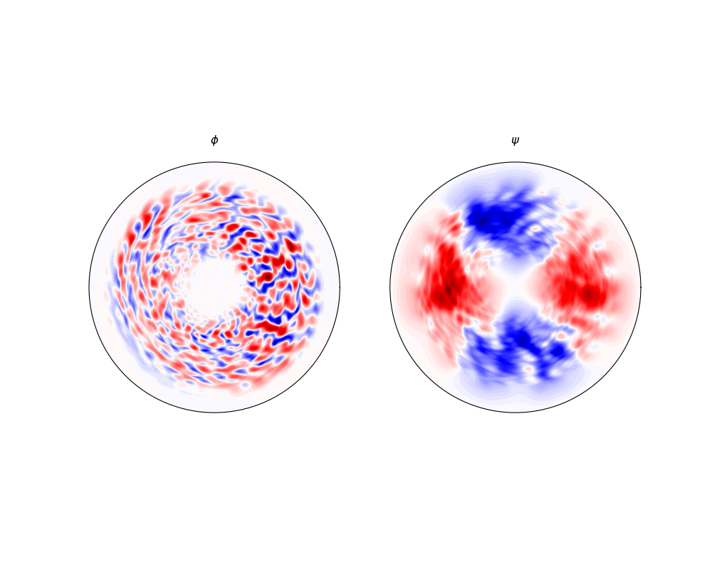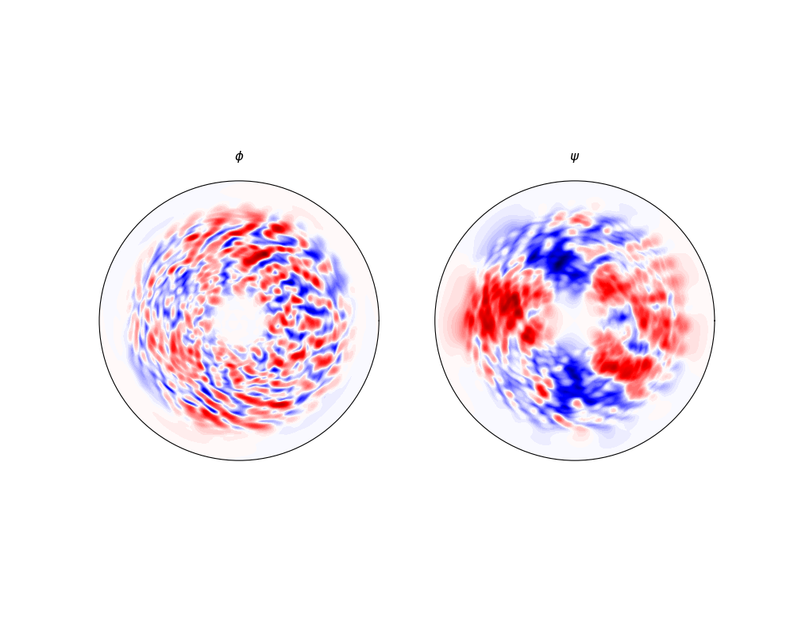
    

    - 静电势扰动，高模数扰动占主导
    - 磁矢势扰动，低模数扰动占主导

- 湍流能量演化
    

- zf能量演化
    

    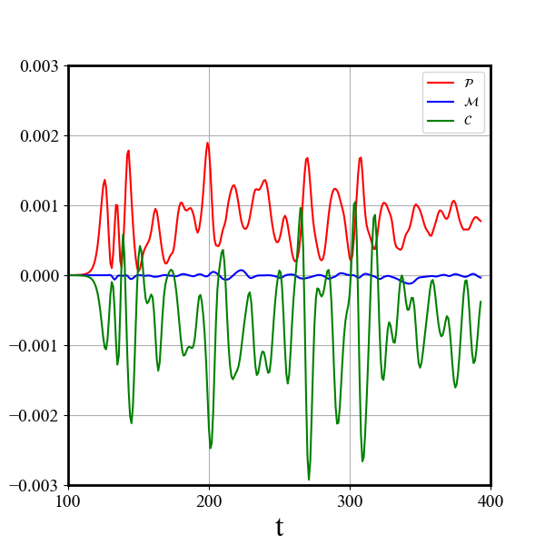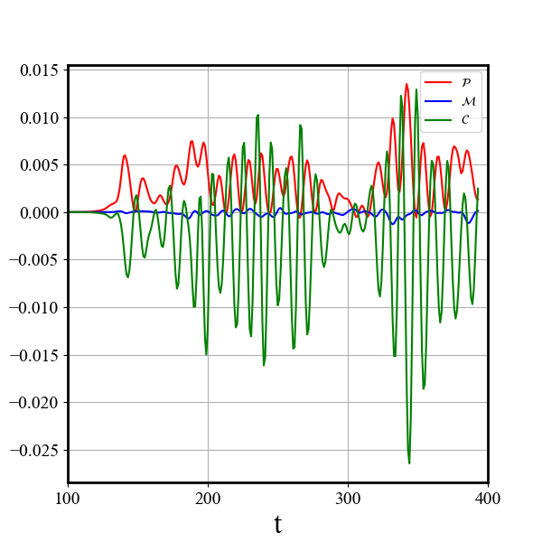
    

    

    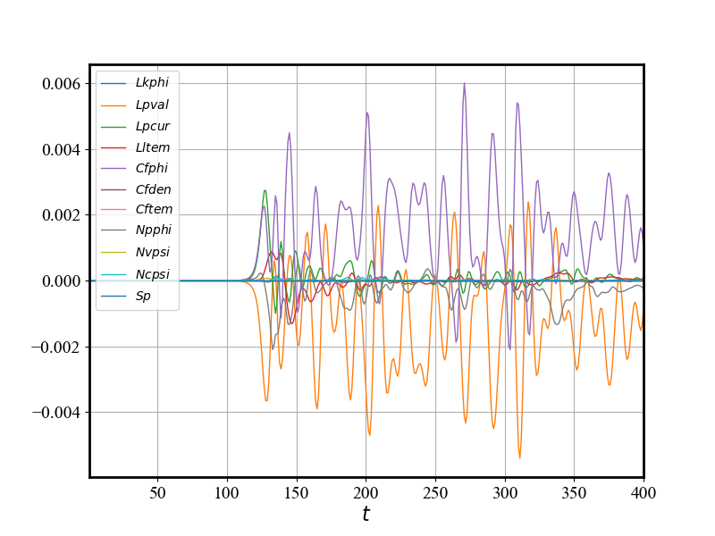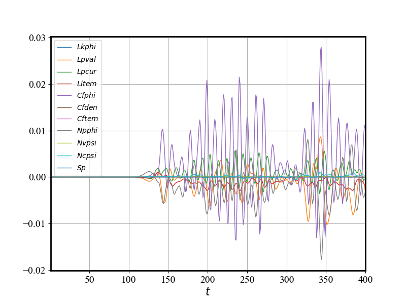
    

    

    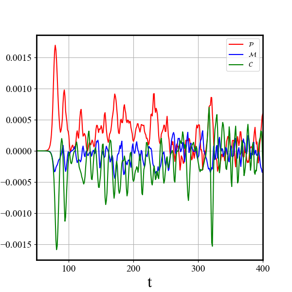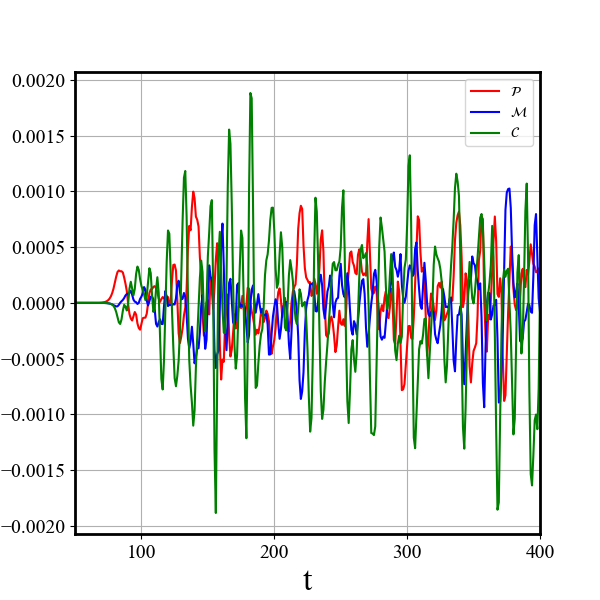
    

    

    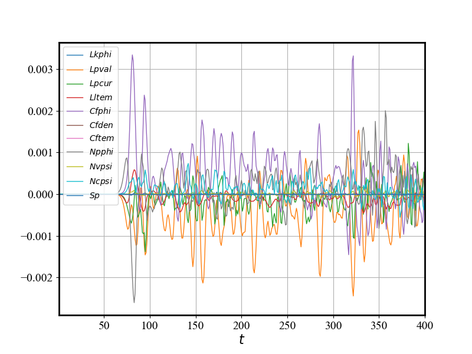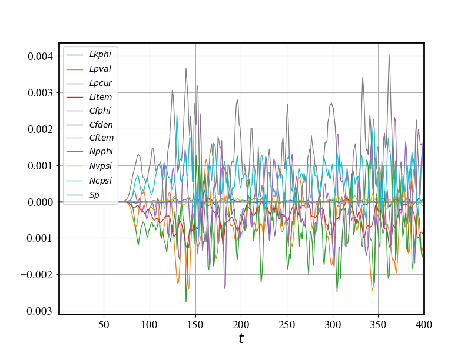
    
